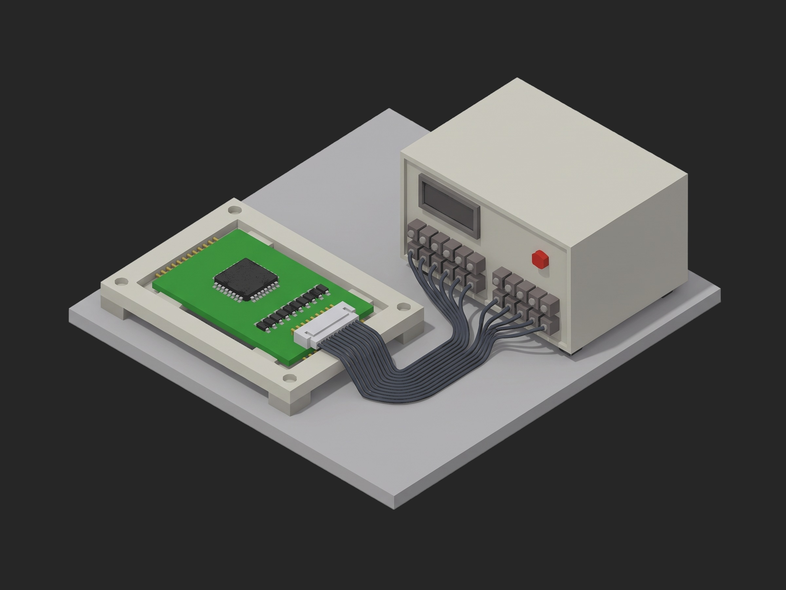

# Framework BMS Cell Simulator Functional Test



A TofuPilot Framework procedure for the functional test of a 16S BMS PCBA on a battery cell simulator: identity and configuration readback over UART, per-channel voltage accuracy on a monotonic staircase that exposes a crossed sense harness, gain and offset from a three-point sweep, open-wire detection with the fault map checked after reconnect, the series resistance of every sense tap measured through the bleed path, and the ship-mode current on the simulator's 250 µA range. The mock bench synthesizes a healthy board with one channel near the offset limit and one marginal crimp, so the run is green and the charts have something to show.

## What This Shows

| Feature | Where |
|---------|-------|
| Setup gate on identity, teardown that always parks the board | `setup:` / `teardown:` in `procedure.yaml` |
| String `matches`, string `==` and JSON `==` validators | `firmware_version`, `config_crc`, `afe_identity`, `faults_after_reconnect` |
| Multi-dimensional measurements with custom aggregations validated in YAML | `staircase` (`max_mv`, `min_mv`), `linearity` (`max_abs_pct`, `max_abs_mv`), `tap_path` (`max_mohm`) |
| Asymmetric limits copied from the AFE datasheet | `staircase.error` -- `<= 3.5` / `>= -4.0` mV |
| Sequential `depends_on` chain on one shared bench | every `main:` phase |
| Plug `config` passed as constructor arguments | `plugs/bms_bench.py` -- `BmsBench(cell_count, bleed_ma)` |
| Unit metadata stamped from the DUT | `phases/identify_dut.py` -- `unit.metadata["afe_die_rev"]` |
| Phase timeout | `tap_resistance` -- `timeout: 60s` |

## Get Started

1. Sign up for a free TofuPilot account at [tofupilot.app](https://www.tofupilot.app/auth/signup).
2. Open the **New Procedure** flow in the dashboard and clone this template.
3. Follow the dashboard's instructions to set up a station and run the procedure.

For deeper guides, see the [TofuPilot docs](https://www.tofupilot.com/docs/framework) and the [BMS Cell Simulator Functional Test template page](https://www.tofupilot.com/templates/bms-cell-simulator-functional-test).

## Structure

```
.
├── procedure.yaml                    # Procedure, plug, phases, measurements
├── phases/
│   ├── identify_dut.py               # Setup: pack to 3.6 V/cell, identity block, config CRC
│   ├── cell_voltage_accuracy.py      # Staircase, per-channel error, channel order
│   ├── gain_offset_sweep.py          # 3-point sweep, gain error and offset per channel
│   ├── open_wire_check.py            # One channel opened, fault map before and after
│   ├── tap_resistance.py             # Bleed current through each tap, R = dV / I
│   └── shutdown.py                   # Teardown: ship mode, quiescent draw, outputs off
├── plugs/
│   └── bms_bench.py                  # Mock cell simulator + DUT UART (one plug per bench)
├── utils/
│   └── recipe.py                     # Channel count, staircase, sweep points, open-wire channel
├── pyproject.toml                    # uv-managed Python project
└── README.md
```

## Replace the Mock with Real Hardware

`plugs/bms_bench.py` maps to two links: the cell simulator over SCPI (a Chroma 87001, Keysight SL1010A or Pickering 41-752A, with four-wire sense on every channel) and the DUT's UART or I²C service port over pyserial. Keep the simulator's own readback as the truth, not its setpoint. The phases, measurements and limits stay the same.
